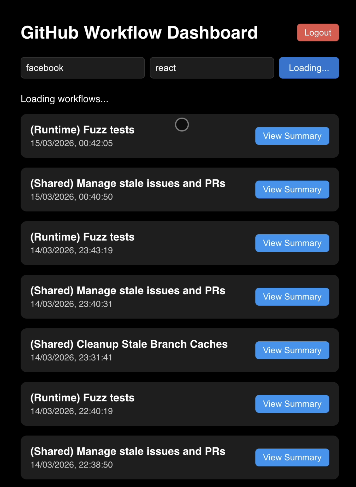
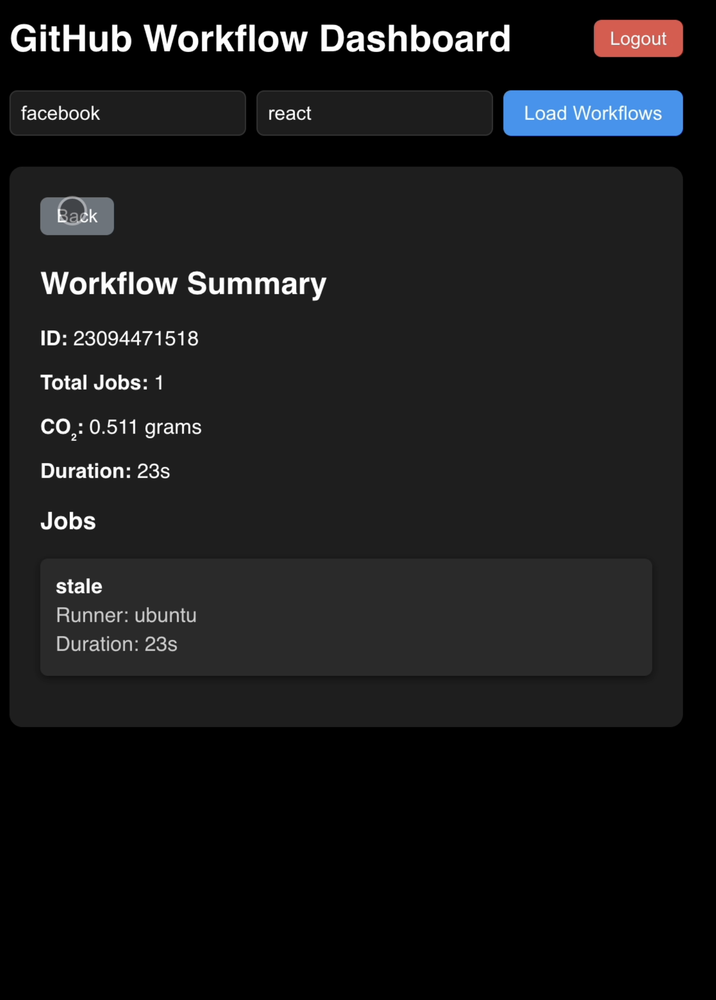

# GitHub OAuth Backend

This project is a **Node.js Express backend** that implements GitHub OAuth authentication. It allows a frontend application to authenticate users via GitHub, check authentication status, and handle login/logout flows. This backend can be used for applications that need to interact with GitHub APIs (like fetching workflows, repos, etc.) securely.

---

## Features

- GitHub OAuth login
- OAuth callback to exchange `code` for access token
- Authentication status check
- Logout functionality (clears session)
- Environment-based configuration for client ID, secrets, and URLs

---

## Tech Stack

- **Node.js** & **Express**
- **Axios** for HTTP requests
- **dotenv** for environment variables
- **express-session** for session management

---

## Setup

```bash
# 1. Clone the repository
git clone https://github.com/your-username/github-oauth-backend.git
cd github-oauth-backend

# 2. Install dependencies
npm install

# 3. Configure environment variables
# Create a `.env` file in the root directory with the following content:

GITHUB_CLIENT_ID=your_github_client_id
GITHUB_CLIENT_SECRET=your_github_client_secret
GITHUB_CALLBACK_URL=http://localhost:5000/auth/callback
OAUTH_BASE_URL=https://github.com
FRONTEND_BASE_URL=http://localhost:3000
SESSION_SECRET=your_session_secret
```




